# This is for tutorial

Necessary Prerequisites Before Executing Python Code!!!
=======================================================

Installing Python and tools for writing codes
https://algotom.readthedocs.io/en/latest/toc/section1/section1_1.html

Setting up a Python workspace
https://algotom.readthedocs.io/en/latest/toc/section4/section4_1.html

Input file
==========

EZPIT is a software tool that can process ".xyz coordinate file" data from 
various 3D modeling programs. These programs include Mercury, Discovery Studio, 
VESTA, Avogadro, CrystalMaker and more. To use EZPIT with atom and ion, the user must 
match their name with the one in the atomic form factor file (aff_elementonly.txt). 
This file can be found in the "data" folder of EZPIT. Here are some examples of xyz 
coordinate file format.

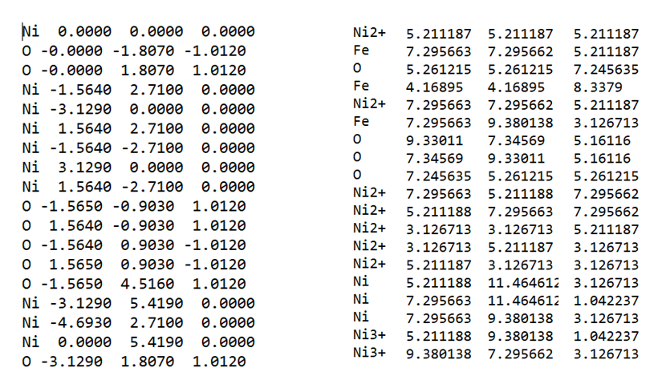

An experimental G(r) file is a text file that contains the radial distribution 
function of a material. The file has two columns: the first one is the distance r 
in angstroms, and the second one is the value of G(r) at that distance. 
The file does not have any header or footer lines, and the columns are separated by 
spaces or tabs. An example of an experimental G(r) file is:

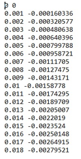

When you use xPDFsuite or pdggetX2 to produce G(r), you may notice some extra lines 
at the beginning of the file. These are header or footer lines that contain some metadata. 
If you want to keep them, you can specify the number of lines to skip in the row parameter 
in “def load_atom_names(file_path)” function.
EZPIT also requires two files including “aff_elementonly.txt” and “aff_parmonly.txt”. 
“aff_elementonly.txt” include all atoms and ions fore atomic form factors and “aff_parmonly.txt” 
has parameters for atomic form factors. The table of atomic form factor was obtained from 
“International Tables for Crystallography (2006). Vol. C, ch. 4.3, pp. 259-429” and 
the equation of atomic form factor is 

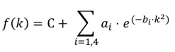

where f(k) is the atomic form factor of the i-th atom or ion, q is the momentum transfer, 
ai, bi and C are the parameters from the table, and the summation is over four terms.

When the code reads each atom or ions in ".xyz coordinate file", the code finds the row of
each atom or ions in “aff_elementonly.txt” and picks the corresponding parameters 
such as ai, bi and C in the “aff_parmonly.txt”. 

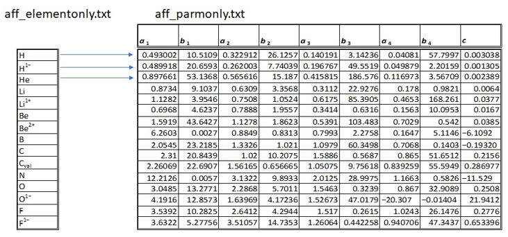

Setup of input file path
========================

As an example, please specify the file path of experimental G(r), .xyz coordinate file, 
aff_elementonly.txt, and aff_paramonly.txt.

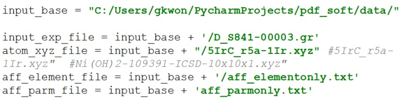

User input information
======================

The following parameters are required for getting scattering intensity I(q), 
structure function S(q), reduced structure function F(q), pair distribution 
function G(r): qmin, qmax, qstep, rmin, rmax, rstep, and qdamp.

I(q) calculation
================

We applied the Debye formula to calculate the scattering intensity I(q) from 
the atomic positions in the input .xyz coordinate file.

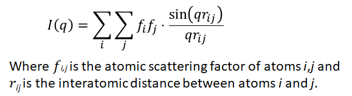

When i = j, 1st term will be zero (0) which is diagonal component if we express
all pairs in matrix. Please see the example below. So, the diagonal elements of 
the matrix will not contribute to the sum of squares of the elements. 
So, the Debye formula will be:

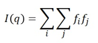

When q = zero (0), sin(qrij)/(qrij) = 1, So, the Debye formula will be:

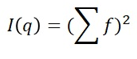

One possible way to explain this is:
The .xyz coordinate file contains the positions of the atoms in a molecule. 
For example, if the .xyz coordinate file has 

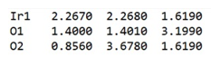

It means that there are three atoms: one iridium and two oxygen. 
To calculate the scattering intensity I(q) as a function of the momentum transfer q, 
we need to consider the distances between all pairs of atoms. 
At q = zero (0), 2nd term is only considered for I(q) When q > 0, 
all pairs are considered as a matrix like below. Diagonal components (when I = j) 
will be  2nd term which is same as when q=zero.

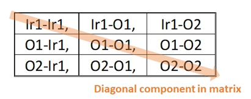

To speed up the computation of I(q) and avoid redundant calculations, 
we used a matrix approach. The function "def group_atoms(atom_names)" 
allows us to extract various information from the .xyz coordinate file, 
such as the names of the atoms, their number, their index, 
and their diversity.

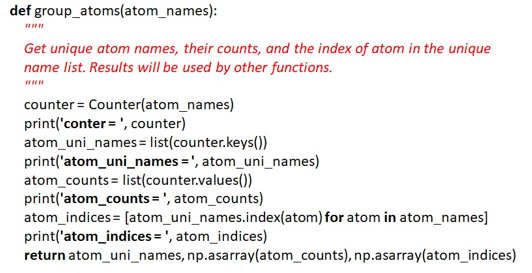

S(q) calculation
================

To determine the structure function S(q), we applied the following formula.

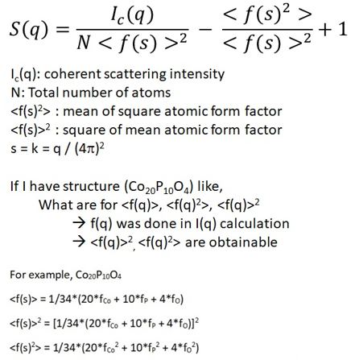

The function “calculate_Sq” takes several arguments, such as atom_indices, 
scattering_factors, atom_distance_matrix, qmin, qmax, qstep, and return_Iq. 
It computes the structure function S(q) for a given set of atoms and 
scattering factors. And the mean of square atomic form factor <f2> 
and the square of mean atomic form factor <f>2 can also be calculated.

G(r) calculation by integral function and inverse fast Fourier transform (IFFT)
===============================================================================

The integral calculation method is more time-consuming than the IFFT method 
because it requires repeated calculations from rmin to rmax . For each r value, 
the function G(r) has to be integrated from qmin to qmax.

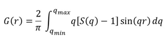

To avoid repletion of calculation, a list was used and please see the function of 
“calculate_Gr_integral”. The following figure illustrates the quality of 
PDF spectrum with different rsetp.

The IFFT method is more efficient than the integral method, but it needs 
the relation between q (reciprocal space) and r (real space) to obtain 
a correct realspace value for G(r). After applying IFFT, the imaginary part of G(r)
was extracted. Also, the real space had to be adjusted with

total_point = int(2 * 3.14159 / (rstep * qstep))
rfine = np.arange(total_point) * rstep

In order to perform an inverse fast Fourier transform (IFFT), 
the data does not have to be a power of 2 (2N) anymore. This means that 
the total number of data points, including the ones that are padded with zeros, 
can be any positive integer. However, if the function F(q) does not start from zero, 
then it is necessary to add a zero value (or an extrapolated or interpolated value) 
for F(q) between zero and qmin before applying the IFFT.

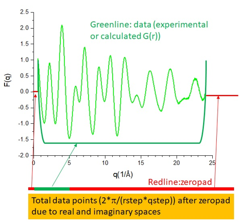

The following figure illustrates how to pad the data by interpolation and 
extrapolation when the line below qmin is zero. This technique can help to
avoid artifacts and improve the quality of the inversion results. 
The padding is done by fitting a straight line (y = ax or y=ax +b) to 
the data points and extending it beyond the original range of qmin and qmax.

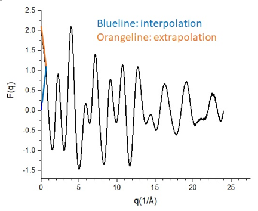

The following paragraph shows how to improve the resolution of G(r) 
by using zeropad in F(q). Zeropad is a technique that inserts zeros 
after qmax in F(q) before performing IFFT. This increases the number 
of data points in G(r) and makes the peaks smoother. Zeropad is a technique 
that improves the quality of G(r) by inserting additional data points 
between the original ones obtained from F(q). This does not mean adding zeros, 
but rather interpolating the data to increase the resolution. 
As a result, the G(r) curve is smoother and more accurate. Without zeropad, 
G(r) has fewer data points and the peaks are more jagged. 
Here is an example of the difference between using zeropad and 
not using zeropad in F(q) and G(r).

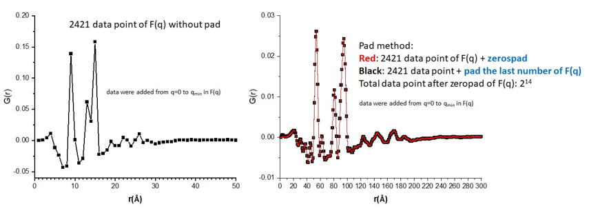

Example:
========
With the xyz coordinate file, EZPIT provides I(q) to G(r). qdamp was zero (0).

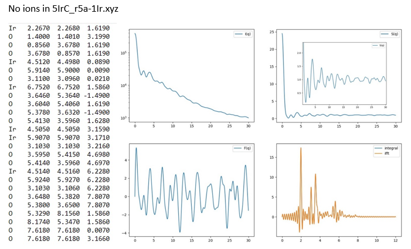

No ions in Ni(OH)2-109391-ICSD-10x10x1.xyz. please see the doc directory.

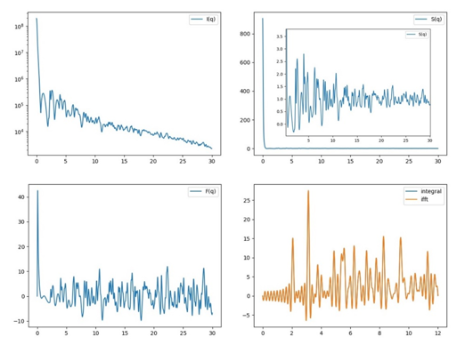

Ions in 5IrC_r5a-1Ir_ion.xyz

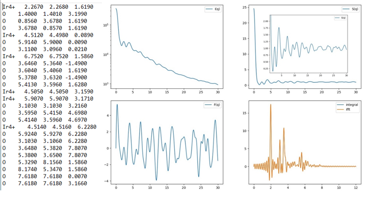

qdamp: The parameter that models the exponential decay of the PDF peaks caused by the finite q-resolution. 
PDF peaks are attenuated by a Gaussian envelope due to q-resolution effects. The envelope has the following form.

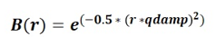

The impact of qdamp on the PDF spectrum can be observed in the following figure.

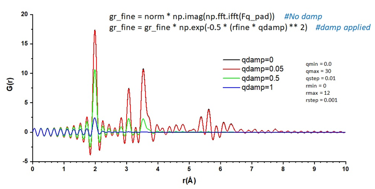

Calculating Compton scattering pattern
======================================

The Compton scattering pattern can be obtained from the equation below.

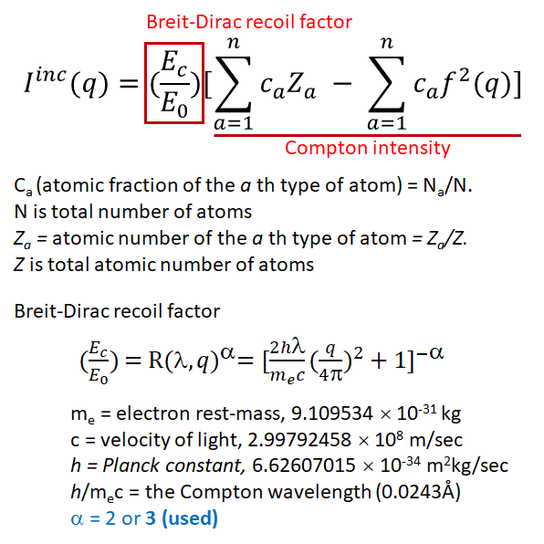

The table for the Compton scattering atomic form factor was obtained from 
D. T. Cromer, J. Chem. Phys. 50, 4857 (1969), and the equation for the Compton scattering atomic form factor is:

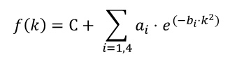

where f(k) represents the Compton scattering atomic form factor of the i-th atom (no ion information). 
k is converted to momentum transfer (q) using (0.25⋅q/π)**2, where ai, bi, and C are the parameters from 
"compton_elementonly.txt". The summation is over five terms. 
When the code reads each atom in the ".xyz coordinate file," it identifies the row of each atom in 
"compton_elementonly.txt" and extracts the corresponding parameters such as ai, bi, and C from "compton_parmonly.txt."

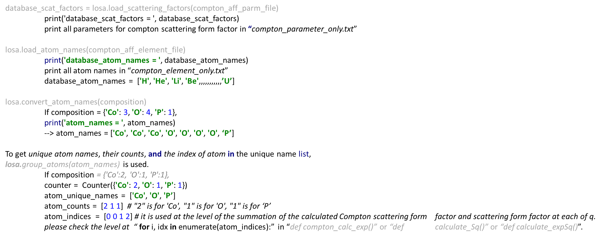

The code for the atomic form factor of Compton scattering is shown below.

The necessary information for calculating the Compton scattering pattern is

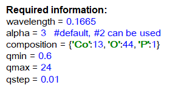

The plot of the calculated Compton scattering pattern for the composition Co2 O2 P1 is displayed below.

Also, several important functions in "loadsaver.py" are explained in terms of their roles. Please see the examples below.

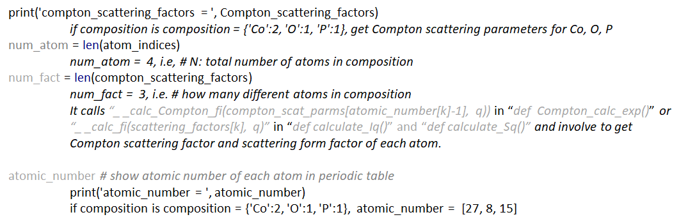

Calculating S(q), F(q), G(r) from experimental I(q)
===================================================
Figure a) displays various experimental and analytical data points: the experimental intensity I(q) (denoted as exp_Iq), 
the scaled background (represented as nn1*bkg), the background-subtracted experimental intensity I(q) 
(labeled as bkg subtracted Iq), Compton scattering (Compton_scat), the mean square of the form factor (mean_square_fi, <f²>), 
the square of the mean form factor (square_mean_fi, <f>²), and the summation of Compton scattering and 
the mean square of the form factor.

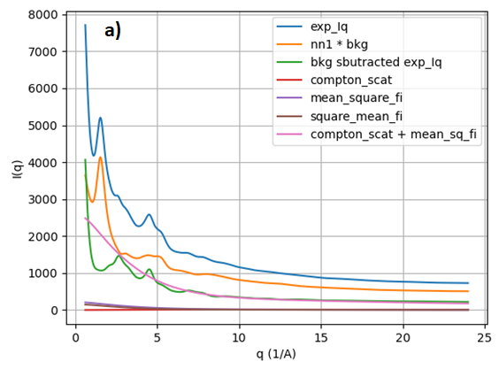

Figure b) presents the background-subtracted experimental intensity I(q) (denoted as bkg subtracted Iq), 
the mean square of the form factor (mean_square_fi, <f²>), and the square of the mean form factor (square_mean_fi, <f>²).

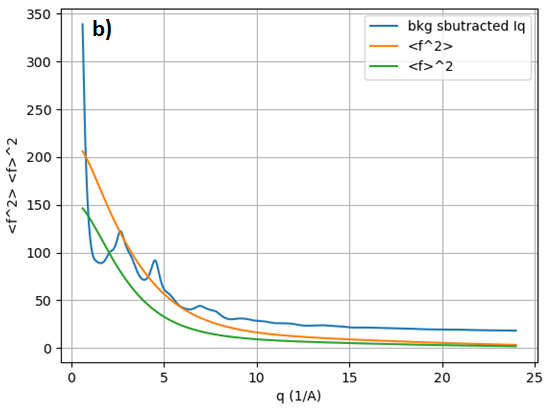

Figure c) exhibits the structure function (not normalized S(q)) derived from the experimental intensity I(q) 
(exp_Iq) in Figure a), along with S(q) (xpdfsute_S(q)) from xPDFsuite for comparison. 
The not normalized S(q) shows an increase in intensity as a function of increasing q (1/Å), 
which is attributed to the instrumental limitations. To normalize the oscillation of S(q) around 1, 
a form of correction is necessary. EZPDF employs a polynomial correction, similar to the approach taken by xPDFsuite.

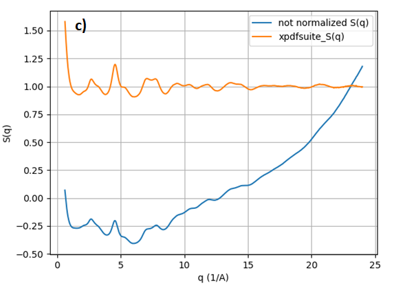

Figure d) illustrates the structure function (S(q)) derived from the experimental intensity I(q) (exp_Iq) shown in Figure a). 
After applying a polynomial correction, S(q) oscillates around 1. 
For comparison, S(q) (xpdfsute_S(q)) obtained from xPDFsuite is also displayed. 
Aside from a difference in scaling, both S(q) representations are identical.

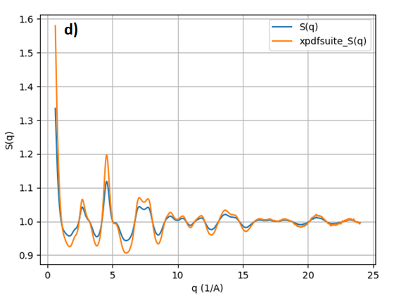

Figure e) presents the reduced structure function (F(q)) derived from S(q) in Figure d), where F(q) oscillates around 0. 
For comparison, F(q) (xpdfsute_F(q)) from xPDFsuite is also shown. Apart from a difference in scaling, 
both versions of F(q) are identical.

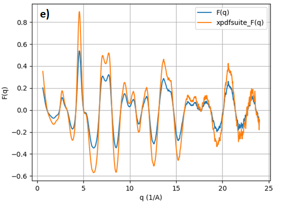

Figure f) displays pair distribution functions (integral-G(r), iff-G(r)) derived from F(q) in Figure e) 
using an integral function and inverse fast Fourier transform (ifft). 
For comparison, G(r) (xpdfsute_G(r)) from xPDFsuite is also shown. Aside from a difference in scaling, 
the pair distribution functions are identical.

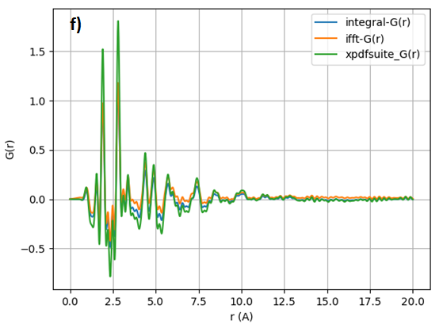

==================================================================================================================
To obtain I(q), S(q), F(q), G(r) from input xyz coordinates, or to derive S(q), F(q), G(r) from experimental I(q) 
or Compton scattering patterns, please refer to the files located in the """examples""" directory.
==================================================================================================================
